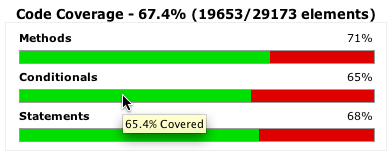
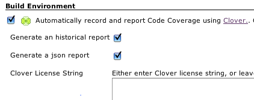
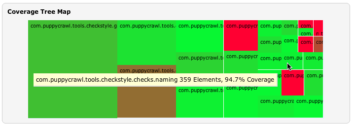

This plugin allows you to capture code coverage reports from
[OpenClover](http://openclover.org/) - a free and open source tool based
on source code of [Atlassian Clover](https://atlassian.com/software/clover/).
Jenkins will generate and track code coverage across time.

[](https://www.youtube.com/watch?v=hvb7wqkiNik)

## Installation

1.  Install Jenkins Clover Plugin.
2.  Install [clover.jar in Ant's classpath](http://openclover.org/doc/manual/latest/ant--adding-to-ants-classpath.html)
    (since Jenkins Clover Plugin 4.10.0).

## Automatic integration for Ant builds

Clover can be integrated into Ant-based builds without the need to modify the build.xml

. Simply check the *"Automatically record and report Code Coverage"* checkbox in the Job configuration screen.



The Clover plugin will add an Ant build listener and appropriate configuration parameters to allow Clover HTML, XML, JSON and Historical reports to be generated for your Job.

These will automatically be linked from the Job and Build pages.


It works for typical build configurations in which unit tests are launched after compilation.
In case you spawn processes, run in-container tests, deploy application to another machine, etc., then the automatic integration will not be sufficient and you'll have to set up integration manually.



## Viewing the report

[](http://twitter.com/cloverallover)

As soon as build is finished, click on the "Clover HTML report" link to display the code coverage report.

Jenkins content security policy blocks any active content in published artficats.
As a result, when you click on the link, it will display the "Loading dashboard.html..." message instead of the report.
In order to fix it, you must relax the policy to allow JavaScript, CSS and images.
See [configuring content security policy](https://www.jenkins.io/doc/book/security/configuring-content-security-policy/) for more details.

## Clover documentation

We recommend reading the official [OpenClover Documentation](http://openclover.org/documentation) home page.
It contains find Clover instructions for Ant, Maven, Grails and other tools.

In case of trouble, you may have a look at the [Atlassian Community](https://community.atlassian.com/) page (questions tagged 'clover').

## Manually configuring the Clover plugin

1.  Install the Clover plugin
2.  Configure your project's build script to generate Clover XML reports
3.  **Optional:** Configure your project's build script to generate
    clover HTML or PDF reports (this plugin prefers HTML reports to
    PDF). The plugin will not extract any information from these
    reports, but will use them as a better formatted most recent
    coverage report when they are available.
4.  Enable the "Publish Clover Coverage Report" publisher
5.  Specify the directory where the clover.xml report is generated.
6.  **Optional:** Configure the coverage metric targets to reflect your
    goals.
    

## Configuring with Jenkins Pipeline jobs

As of version 4.6.0 (and later) of the plugin:

``` groovy
node {
  stage('Clover Coverage') {
    git 'https://github.com/recena/maven-helloworld'
    sh 'mvn clean clover:setup test clover:aggregate clover:clover'
    step([
      $class: 'CloverPublisher',
      cloverReportDir: 'target/site',
      cloverReportFileName: 'clover.xml',
      // optional, default is: method=70, conditional=80, statement=80
      healthyTarget: [methodCoverage: 70, conditionalCoverage: 80, statementCoverage: 80],
      // optional, default is none
      unhealthyTarget: [methodCoverage: 50, conditionalCoverage: 50, statementCoverage: 50],
      // optional, default is none
      failingTarget: [methodCoverage: 0, conditionalCoverage: 0, statementCoverage: 0]
    ])
  }
}
```

## Maven configuration with freestyle project

The clover-maven-plugin is one of the plugins that highlights an issue with how Maven 2 handles aggregator goals.

The Jenkins Clover Plugin does not support the **maven2 project** project type.
Jenkins cannot handle maven aggregator goals with the **maven2 project** project type due to how this project type calls Maven.
In order to obtain multi-module clover reports, you must therefore use the **free-style software project** project type.
In order to ensure that the correct aggregated report is generated, it is necessary to invoke maven multiple times.

*Short answer:*

-   Create the job as a "free-style software project".
-   Enable the "Invoke top-level Maven targets" Build.
-   Specify the following goals for Maven: (Note the use of the pipe
    character \| to invoke maven three times).

```
install -Dmaven.test.failure.ignore=true
|
clover:instrument clover:aggregate
|
-N clover:aggregate clover:clover
```

-   Enable the "Publish Clover Coverage Report" publisher.
-   Depending on your Source Code Management, the clover report
    directory will either be "target/site/clover" or
    "*module-name*/target/site/clover"
-   Don't forget to configure the pom.xml to generate the clover.xml report

    ```
    <project xsi:schemaLocation="http://maven.apache.org/POM/4.0.0 http://maven.apache.org/maven-v4_0_0.xsd">
      <build>
        <plugins>

          <plugin>
            <groupId>org.openclover</groupId>
            <artifactId>clover-maven-plugin</artifactId>
            <configuration>
                <generateHtml>true</generateHtml>
                <generateXml>true</generateXml>
            </configuration>
          </plugin>
        </plugins>
      </build>
    </project>
    ```

### Maven2, Clover and Multimodule with a \<packaging\>ear\</packaging\> child module

The maven2 ear packaging will break if you use the clover goal at any
time during the same invocation of maven if you invoke the **package**
or later phases (as it will see artefacts without a classifier and with
the clover classifier, get confused and give up)

To work around this, you should configure your root pom to include the
\<packaging\>ear\</packaging\> targets only when you are not using
clover... how to do this:

```
<project>
  <profiles>
    <profile>
      <id>running-clover</id>
      <build>
        <pluginManagement>
          <plugins>
            <plugin>
              <groupId>org.openclover</groupId>
              <artifactId>clover-maven-plugin</artifactId>
              <configuration>
                <generateHtml>true</generateHtml>
                <generateXml>true</generateXml>
              </configuration>
            </plugin>
          </plugins>
        </pluginManagement>
      </build>
    </profile>
    <profile>
      <id>not-running-clover</id>
      <modules>
        <module>my-ear-artifact</module>
        <!-- list any other ear child modules here -->
      </modules>
    </profile>
    ...
  </profiles>
  ...
</project>
```

The above... hack... is why it is recommended to invoke maven three times.
If you don't need this hack, you could simplify down to two invocations.
For example:

```
install clover:instrument
|
-N clover:aggregate clover:site
```

# Version history

See [CHANGELOG](CHANGELOG.md)
